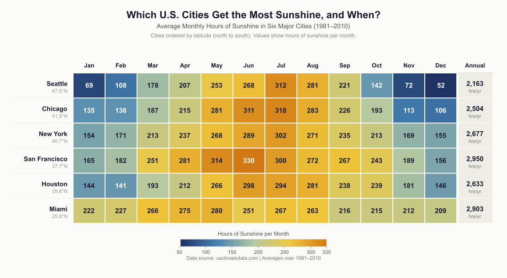

# Which U.S. Cities Get the Most Sunshine, and When?

A data visualization exploring how monthly sunshine hours vary across six major U.S. cities and whether latitude predicts sunshine patterns.



## About

This heatmap visualizes average monthly hours of sunshine (1981–2010) for six U.S. cities ordered by latitude from north to south: Seattle, Chicago, New York, San Francisco, Houston, and Miami. A sequential cool-to-warm color scale encodes sunshine hours, with exact values printed in each cell for precision.

## Key Findings

- Northern cities like Seattle experience dramatic seasonal swings (52 hrs in December → 312 hrs in July)
- Southern cities like Miami maintain consistent sunshine year-round
- Latitude predicts seasonal *variance* but not total sunshine — San Francisco (2,950 hrs/yr) beats Miami (2,903 hrs/yr)

## Tech Stack

- **Node.js** with the `canvas` package for server-side image rendering
- Data source: [usclimatedata.com](https://usclimatedata.com) (30-year averages, 1981–2010)

## Usage

```bash
npm install
node create_viz.js      # generates visualization.png
node server.js           # preview at http://localhost:8123
```
